# 第一节：安装系统

如果你的使用的系统已经是Ubuntu或者有一个运行着Ubuntu的电脑/开发板，那么你可以跳过这一节了。

## 在实体机上面安装

实体机，就是我们平时使用的笔记本、台式机等等。在物理机上面安装Ubuntu操作系统，体验是最好的。

Ubuntu系统除了官方发行的版本外，还有许多其他的版本，如`KUbuntu`等。下面是一种在物理机上安装官方版本的Ubuntu的方法。

### 下载系统镜像文件

由于Ubuntu官网在国内的连接速度较慢，所以读者可以前往各大镜像站下载镜像文件。下面以阿里云为例子。

首先，前往[阿里巴巴开源镜像站](https://developer.aliyun.com/mirror/)，点击OS镜像：

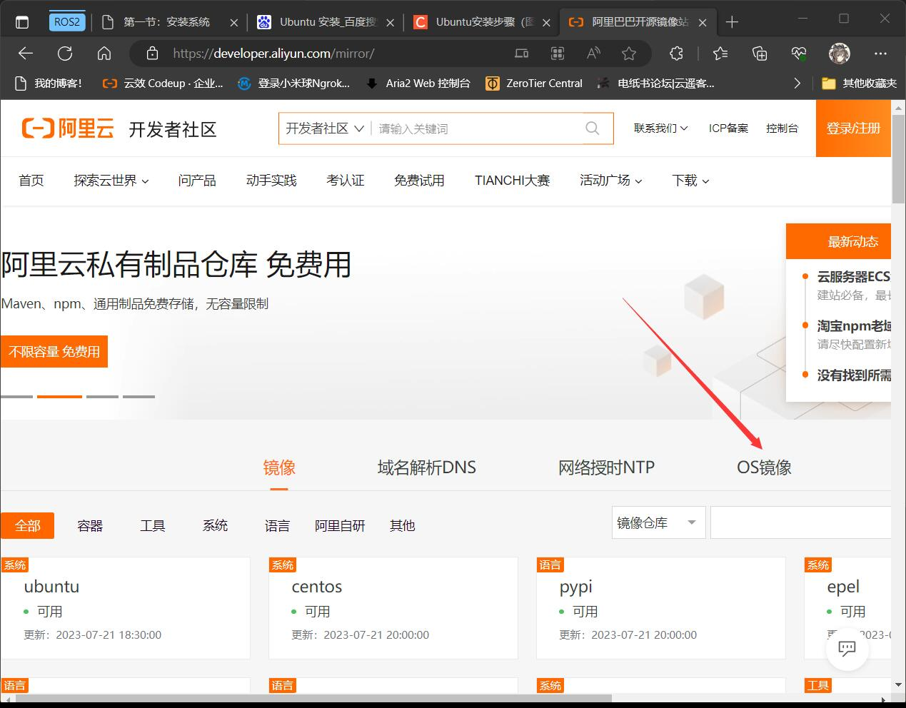

选择发行版为 `Ubuntu`，版本小于 `23.04` 即可。请注意这里需要选择 `(desktop-amd64)` 版本以下载带有GUI界面的版本，否则只是个命令行O(∩_∩)O。

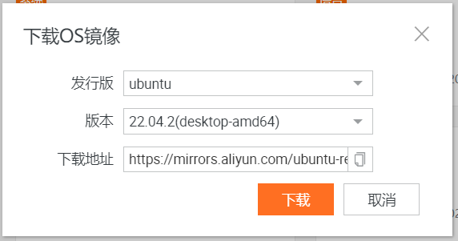

> 一般下载LTS版本，LTS=long term support，长期支持版本，维护更新周期一般为3-5年，一般都是稳定正式版本。

> 当前Ubuntu的最新LTS版本为 `Ubuntu 22.04.2 LTS`

### 下载U盘启动制作工具

有很多工具能够制作可启动的U盘，如Etcher、rufus和Ventoy等。下面我们将会使用Ventoy制作启动盘。Ventoy无需反复格式化U盘，只需要将镜像文件复制到U盘里面，其就能识别到镜像文件的存在。在无需安装系统时候，制作的U盘同样可以用于存储数据，方便实用。

Ventoy的下载地址为：[下载地址](https://www.ventoy.net/cn/download.html)

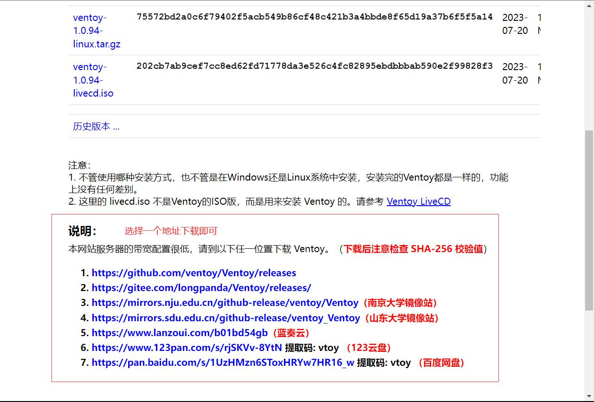

### 制作可启动的U盘

> 参考文档：https://www.ventoy.net/cn/doc_start.html

- 将U盘或者移动硬盘插入电脑
- 将下载好安装包，例如 ventoy-1.0.00-windows.zip 然后解压开。
- 直接执行 Ventoy2Disk.exe 如下图所示，选择磁盘设备，然后点击 安装 按钮即可。

> **注意**：此处是特别提醒，你U盘上的资料将会全部被清空，请再确认要进行此操作

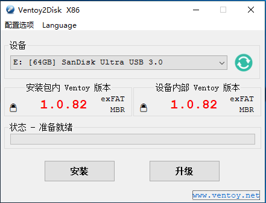

### 复制镜像文件

安装完成之后，U盘会被分成两个分区（参考 [说明](https://www.ventoy.net/cn/doc_disk_layout.html)）

其中第一个分区，会被格式化成exFAT文件系统，一般的卷标为`Ventoy`。只需要把之前下载好的镜像文件复制到分区里面即可。这里可以把镜像放在分区内任意的文件夹下。

一个复制好镜像的分区如下图所示：

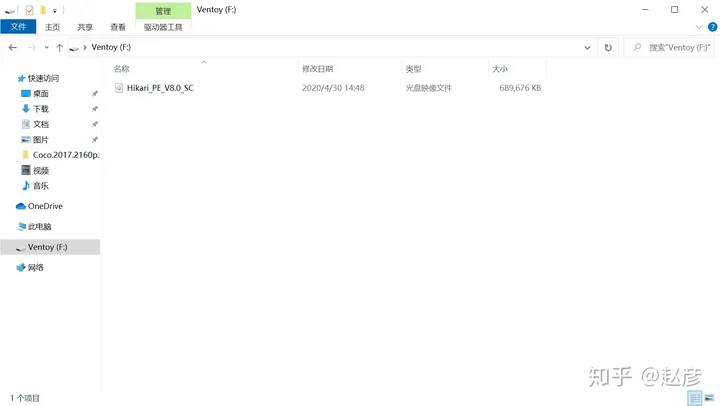

### 开始安装Ubuntu

> 参考网站：[Install Ubuntu desktop | Ubuntu](https://ubuntu.com/tutorials/install-ubuntu-desktop)

> **注意**：将要装系统的电脑的资料备份好，以下流程安装后会**覆盖**原先系统**所有数据**！！！

想要流畅运行Ubuntu，推荐的内存大小至少为4GB。

- 将需要安装系统的电脑连接上互联网，然后将之前制作好的U盘插入电脑。
- 在电脑显示开机提示时，按下 `F12` 进入启动选择，通过方向键选择之前制作的U盘，按 `Enter` 键启动。

> **备注**：不同电脑进入BIOS、开启启动选项的快捷键不同，一般是`F2`、`F8`、`F12`、`ESC`，一般在开机界面会显示

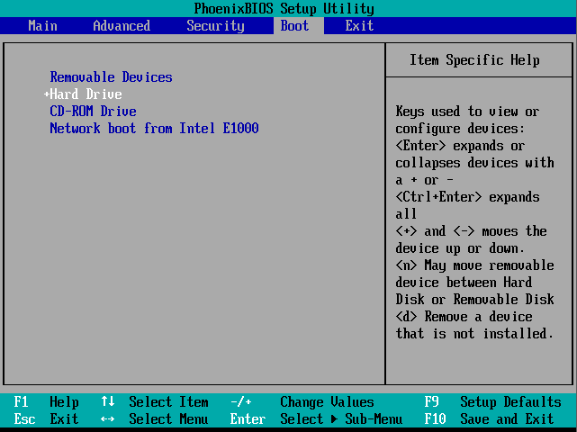

- 随后会进入到Ventoy的启动界面，在列表中选择之前下载好的镜像，按下 `Enter` 键以启动。

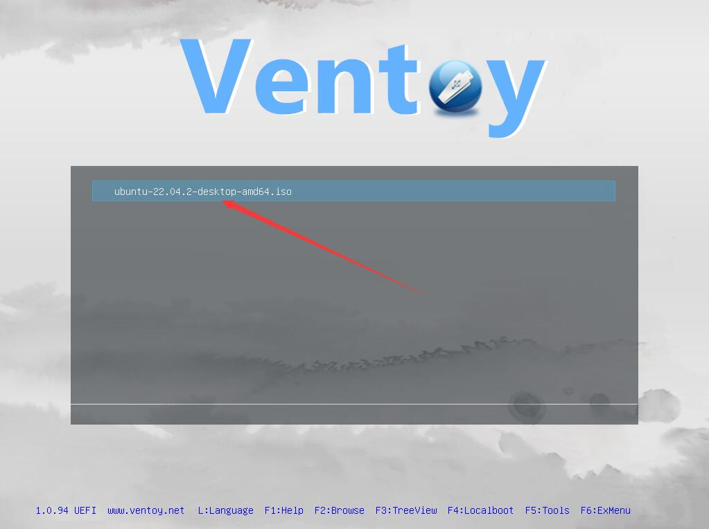

- 然后，选择以normal模式启动，如图所示。

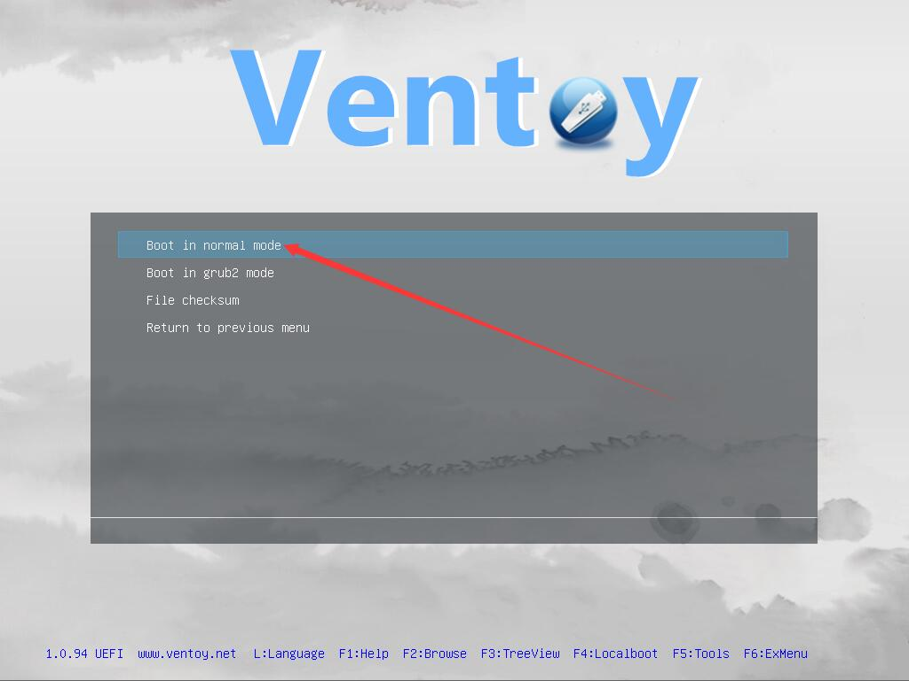

- 之后，会出现Ubuntu 引导菜单，选择第一项 `Try or install Ubuntu` 并按下回车，如图所示。

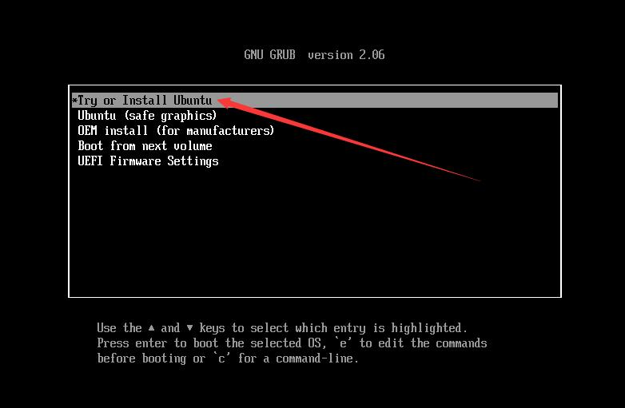

- 然后，会出现Ubuntu logo，并开始检查磁盘等信息，如图。

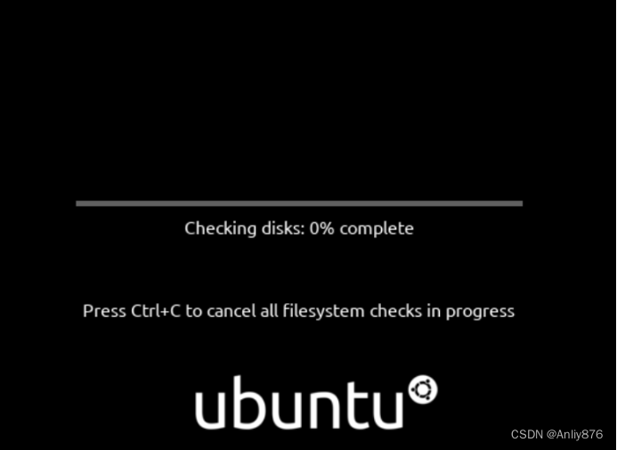

- 检查完后，会进入到Welcome界面，点击`Install Ubuntu`。当然，可以在左边选择简体中文~

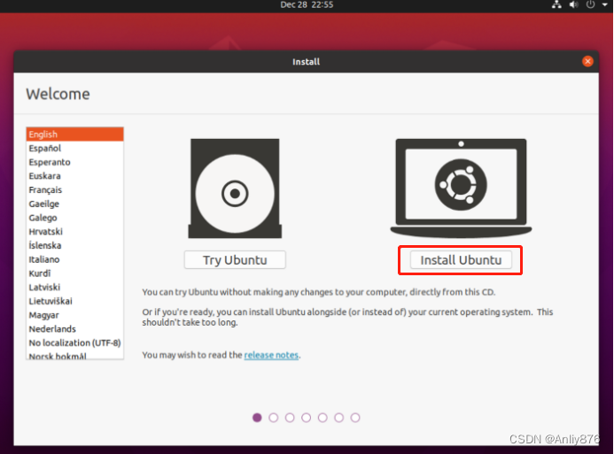

- 进入键盘选择界面，保持默认值，点击 `Continue`

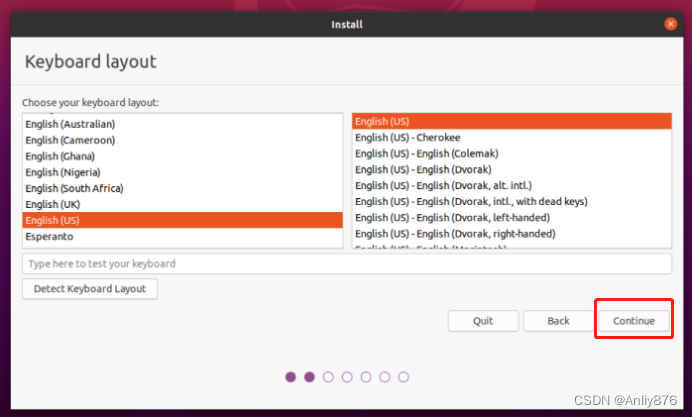

- 点选 `Normal install` ，勾选 `Other options` 下的2个选项，点击 `Continue`

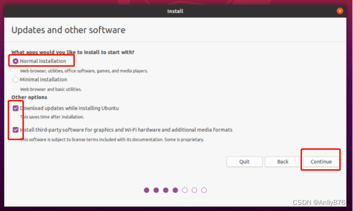

- 接下来是磁盘分区选项，如果没有分区经验的读者，可以选择 `Erase disk and install Ubuntu` 让安装程序自动分区。

> **注意**：这个步骤将删除电脑中的所有资料，如果Windows中有资料需保存，点击`Quit`，重新进入Windows，先把资料备份好，再重新操作安装Ubuntu步骤。

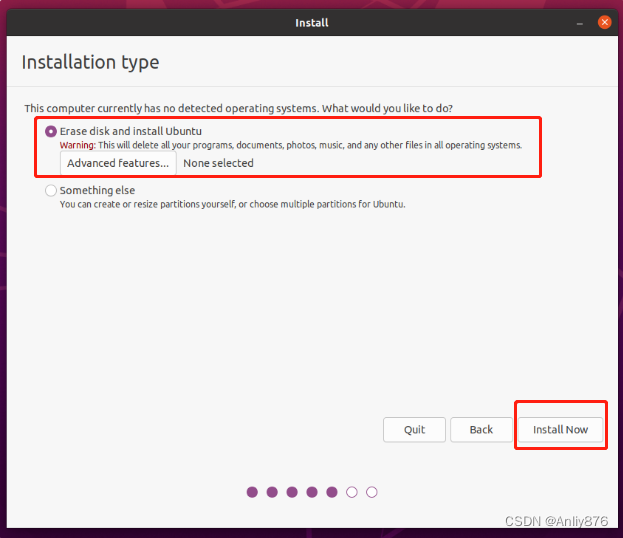

- 选择你的时区，在国内一般选择 `Shanghai` ，点击 `Continue`

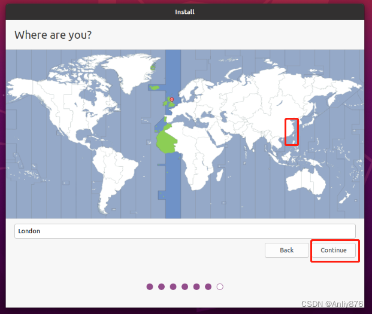
