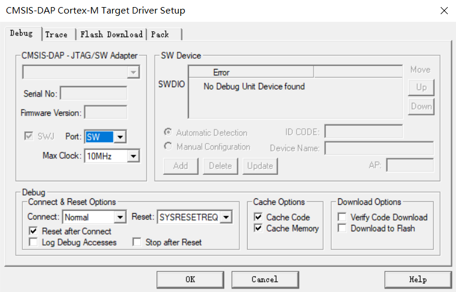

# Robocon电控组初级入队教程


> STM32外设篇——基于HAL库

## 新建工程

1. 下载STM32CubeMX并打开,软件安装见[STM32CubeMX安装](https://blog.csdn.net/as480133937/article/details/98885316)

2. 在主界面选择 **File-->New Project** 

3. 出现芯片型号选择(对于主控板选择芯片型号为 **STM32F407VET6** ，其他控制板根据其使用型号选择)

4. 进入配置页面后选择右侧 **Categories-->System Core-->SYS** ,在 **Debug** 一栏选择 **Serial Wire** 配置芯片下载方式(**!!!重要,若不选择则会出现无法下载的情况,此时需要通过ISP下载,方法见_ISP下载_**)

5. 继续在 **System Core** 中选择 **RCC** ,在 **High Speed Clock(HSE)** 一栏中选择 **Crystal/Ceramic Resonator** 配置芯片使用外部晶振

6. 选择上方 **Clock Configuration** 进入时钟配置页面
   1. 将左侧 **Input frequency** 一栏中改为 *8* ,配置外部晶振频率为8MHz
   2. 在 **PLL Source Mux** 一栏中选择 **HSE** ,配置选择外部晶振作为倍频时钟源
   3. 在 **System Clock Mux** 一栏中选择 **PLLCLK** ,配置选择倍频后频率为系统时钟源
   4. 将 **HCLK(MHz)** 一栏改为 *168* 并按下回车,此时CubeMx会自动计算倍频,分频系数(F1控制板改为72)
   5. 至此时钟配置完成
7. 选择上方 **Project Manager** 进入工程管理界面
   1. 在 **Project Name** 一栏中填写工程名
   2. 点击 **Project Location** 后 **Browse** 中选择工程存放的位置( **!!!** 存放路径不可有中文)
   3. 在 **Toolchain/IDE** 一栏中选择 **MDK-ARM**
   3. 点击左侧的 **Code Generator** 进行进一步的配置
   3. 点击 **Copy only the necessary library files** (只复制必要的库文件)
   3. 点击 **Generate peripheral initialization as a pair of '.c/.h' files per peripheral** (为每个外设生成.c/.h文件)
   3. 最后点击右上角 **GENERATE CODE**  创建工程完成工程新建

## 程序烧录

使用Keil打开工程,如图点击上方魔法棒进入配置界面


选择编译器V6.16


点击 **Debug** -->下拉选择 **CMSIS-DAP Debugger** (若使用ST-Link等其他下载器则改为相应下载器)-->点击 **Setting** 进入下载器
设置界面


如图配置



点击此界面上方 **Flash Download** 进入下载设置界面-->点击 **Reset and Run**  开启下载后自动重置并运行


关闭所有界面回到Keil主界面-->点击编译按钮开始编译-->点击下载按钮进行下载


出现如下提示表示下载成功,恭喜你完成第一步!!!


## GPIO操作

### 配置GPIO

1. 点击任意一个可用引脚-->根据需求选择GPIO模式(GPIO_Input/GPIO_Output)

2. 输出配置 
   1. 点击**Categories**-->**System Core**-->**GPIO**进入GPIO配置界面
   
   2. 点击上一步选择的引脚号进行配置,各项配置含义如下
      1. **GPIO output level**:初始化后引脚的输出电平 
          Low:低电平 High:高电平
      
      2. **GPIO mode**:GPIO输出模式,常用Output Push Pull(推挽输出)其他模式作用见[GPIO模式](https://blog.csdn.net/as480133937/article/details/98063549)
      
      3. **GPIO Pull-up/Pull-down**:GPIO上拉/下拉
      
          No pull-up and no pull-down:不上拉也不下拉
      
          Pull-up:上拉
      
          Pull-down:下拉
      
      4. **Maximum output speed**:输出速度
      
          Low:低
      
          Medium:中
      
          High:高
      
          Very High:非常高
      
      5. **User Label**:用户标签,用于自定义引脚的名称

3. 输入配置
   1. 点击**Categories**-->**System Core**-->**GPIO**进入GPIO配置界面
   
   2. 点击上一步选择的引脚号进行配置,各项配置含义如下
   
      1. **GPIO mode**:GPIO输入模式,只有Input mode 输入模式
   
      1. **GPIO Pull-up/Pull-down**:GPIO上拉/下拉(上下拉作用也见[GPIO模式](https://blog.csdn.net/as480133937/article/details/98063549))
   
         No pull-up and no pull-down:不上拉也不下拉
   
         Pull-up:上拉
   
         Pull-down:下拉
   
   3. **User Label**:用户标签,用于自定义引脚的名称
   

### GPIO输出

------

#### GPIO输出高电平

```c
HAL_GPIO_WritePin(UserLabel_GPIO_Port,UserLabel_Pin,GPIO_PIN_SET)
```

其中UserLabel为GPIO配置中配置的用户标签

GPIO_PIN_SET的值为1,也可直接写成如下情况

```c
HAL_GPIO_WritePin(UserLabel_GPIO_Port,UserLabel_Pin,1)
```

------

#### GPIO输出低电平

```c
HAL_GPIO_WritePin(UserLabel_GPIO_Port,UserLabel_Pin,GPIO_PIN_RESET)
```

其中UserLabel为GPIO配置中配置的用户标签

GPIO_PIN_SET的值为0,也可直接写成如下情况

```
HAL_GPIO_WritePin(UserLabel_GPIO_Port,UserLabel_Pin,0)
```

------

#### GPIO翻转

```
HAL_GPIO_TogglePin(UserLabel_GPIO_Port, UserLabel_Pin)
```

调用此函数GPIO会翻转电平,即高电平变为低电平,低电平变为高电平,常用于LED的闪烁

### GPIO输入

------

#### GPIO电平读取

```
HAL_GPIO_ReadPin(UserLabel_GPIO_Port,UserLabel_Pin)
```

此函数会返回GPIO电平,0为低电平,1为高电平

## 定时器中断操作

### 配置定时器

1. 在**Pinout&Configuration**页面选择**Timers-->TIM1**
2. 点击**Clock Source**选择时钟源为**Internal Clock**内部时钟源
3. 在下方 **Parameter Settings** 一栏中配置定时周期 <sup><a href="#/Robocon电控组初级入队教程?id=ref1">1</a></sup>(根据实际需求更改)
   1. 修改 **Prescaler (PSC - 16 bits value)** 为167
   2. 修改 **Counter Period(AutoReload Register - 16 bits value)** 为9999
4. 点击**NVIC Settings** 配置定时器中断
5. 点击**TIM8 trigger and commutation interrupts and TIM14  global interrupt** 后的方框使能定时器中断

### 使能定时器中断

------

#### 定时器中断使能函数

```c
HAL_TIM_Base_Start_IT(&htim1);
```

在主函数中调用一次此函数开启定时器中断

### 定时器中断

------

#### 定时器中断回调函数

```c
void HAL_TIM_PeriodElapsedCallback(TIM_HandleTypeDef *htim)
{
  if (htim->Instance == TIM1)
  {
	/*code*/
  }
}
```

此函数可放置在任意位置,定时器发生中断后会调用此函数,在此函数中使用if语句判断中断来源并在**/\*code\*/**处编写相应中断的服务函数(建议新建一个interrupt.c文件用于集中存放所有中断回调函数)

<p id="ref1">定时周期=*(Prescaler+1)\*(Counter Period+1)/Tclk*,此时定时周期为(167+1)\*(9999+1)/(168M) = 0.01s即10ms</p>

## 串口操作

### 配置串口

1. 在**Pinout&Configuration**页面选择**Connectivity-->USART1**
2. 在**Mode**一栏选择**Asynchronous**(异步通信)
3. 在下方**Parameter Settings**一栏中修改**Baud Rate**(波特率)为**256000Bits/s**(波特率可根据实际情况修改)
4. 点击**NVIC Settings** 配置串口中断
5. 点击**USART1 global interrupt** 后的方框使能串口中断

### 初始化串口

------

#### 串口中断开启函数

```c
HAL_UART_Receive_IT(UART_HandleTypeDef *huart, uint8_t *pData, uint16_t Size)
```

调用此函数开启串口中断

1. *huart为要开启的串口号
2. *pData为串口发生中断后,串口接收到数据的存放地址
3. Size为接收的数据长度

### 串口发送

------

#### 串口发送函数

```c
HAL_UART_Transmit(UART_HandleTypeDef *huart, uint8_t *pData, uint16_t Size, uint32_t Timeout)
```

1. *huart为要发生的串口号
2. *pData发送数据的存放地址
3. Size发送数据长度
4. Timeout最大发送时间

### 串口接收

------

#### 串口接收中断回调函数

```c
void HAL_UART_RxCpltCallback(UART_HandleTypeDef *huart)
{
    if (huart->Instance == USART1)
    {
       /*code*/
    }
}
```

此函数可放置在任意位置,串口发生中断后会调用此函数,在此函数中使用if语句判断中断来源并在**/\*code\*/**处编写相应中断的服务函数(建议新建一个interrupt.c文件用于集中存放所有中断回调函数)

**!!!因为中断接收函数只能触发一次接收中断,所以我们需要在中断回调函数中再调用一次中断开启函数。否则只能进行一次中断**

## CAN操作

### 配置CAN

1. 在**Pinout&Configuration**页面选择**Connectivity-->CAN1**(对于F1芯片,选择**Connectivity-->CAN**)

2. 点击**Activated**激活CAN

3. F4配置如右图(注意!先配置**Time Quanta in Bit Segment 1**,**Time Quanta in Bit Segment 2**,再配置**Prescaler**,否则会报错)

   

4. F1配置如右图

   

5. 点击**NVIC Settings**->**CAN1 RX0 interrupts**使能CAN1 RX0中断(F1芯片类似,F4的CAN2须使能**CAN2 RX1 interrupt**)

### 初始化CAN
------

#### CAN1过滤器配置与接收中断激活函数

```c
void User_Can1_Config(void)
{
    extern CAN_HandleTypeDef hcan1;
    CAN_FilterTypeDef sFilterConfig;
    /*配置 CAN 过滤器*/
    sFilterConfig.FilterBank = 0; //过滤器 0
    sFilterConfig.FilterMode = CAN_FILTERMODE_IDMASK;
    sFilterConfig.FilterScale = CAN_FILTERSCALE_32BIT;
    sFilterConfig.FilterIdHigh = 0x0000; // 32 位 ID
    sFilterConfig.FilterIdLow = 0x0000;
    sFilterConfig.FilterMaskIdHigh = 0x0000; // 32 位 MASK
    sFilterConfig.FilterMaskIdLow = 0x0000;
    sFilterConfig.FilterFIFOAssignment = CAN_RX_FIFO0; //过滤器 0 关联到 FIFO0
    sFilterConfig.FilterActivation = ENABLE;           //激活滤波器 0
    sFilterConfig.SlaveStartFilterBank = 14;

    //过滤器配置
    if (HAL_CAN_ConfigFilter(&hcan1, &sFilterConfig) != HAL_OK)
    {
        Error_Handler();
    }

    //启动 CAN 外围设备
    HAL_CAN_Start(&hcan1);
    //激活可以 RX 通知
    HAL_CAN_ActivateNotification(&hcan1, CAN_IT_RX_FIFO0_MSG_PENDING);
}
```

在CAN初始化后调用一次该函数,设置CAN过滤器并激活CAN接收(F1芯片将代码中的**hcan1**改为**hcan**即可)

#### CAN2过滤器配置与接收中断激活函数

对于CAN2,其过滤器配置与接收中断激活函数如下( **!!!** 注意,CAN2必须在CAN1时钟使能后使用,尽量先用CAN1,再用CAN2)

```c
void User_Can2_Config(void)
{
    extern CAN_HandleTypeDef hcan2;
    CAN_FilterTypeDef sFilterConfig;
    /*配置 CAN 过滤器*/
    sFilterConfig.FilterBank = 15; //过滤器 15 CAN2的过滤器必须在14以上
    sFilterConfig.FilterMode = CAN_FILTERMODE_IDMASK;
    sFilterConfig.FilterScale = CAN_FILTERSCALE_32BIT;
    sFilterConfig.FilterIdHigh = 0x0000; // 32 位 ID
    sFilterConfig.FilterIdLow = 0x0000;
    sFilterConfig.FilterMaskIdHigh = 0x0000; // 32 位 MASK
    sFilterConfig.FilterMaskIdLow = 0x0000;
    sFilterConfig.FilterFIFOAssignment = CAN_RX_FIFO1; //过滤器 15 关联到 FIFO1
    sFilterConfig.FilterActivation = ENABLE;           //激活滤波器 0
    sFilterConfig.SlaveStartFilterBank = 15;

    //过滤器配置
    if (HAL_CAN_ConfigFilter(&hcan2, &sFilterConfig) != HAL_OK)
    {
        Error_Handler();
    }

    //启动 CAN 外围设备
    HAL_CAN_Start(&hcan2);
    //激活可以 RX 通知
    HAL_CAN_ActivateNotification(&hcan2, CAN_IT_RX_FIFO1_MSG_PENDING);
}
```

### CAN发送
------

#### CAN1发送函数

此函数为自己编写,需要将此函数添加到can.c中(F1芯片类似,将其中**hcan1**改为**hcan**即可)

如图所示将函数声明加入到can.h中

```c
void CAN1_Send_Message(uint32_t StdID, uint8_t *Data)
{
  uint32_t TxMailbox;
  uint8_t message[8];
  uint8_t i = 0;
  CAN_TxHeaderTypeDef CAN_Txstructure;
  CAN_Txstructure.DLC = 8;
  CAN_Txstructure.StdId = StdID;
  CAN_Txstructure.IDE = CAN_ID_STD;
  CAN_Txstructure.RTR = CAN_RTR_DATA;

  for (i = 0; i < 8; i++)
  {
    message[i] = Data[i];
  }

  HAL_CAN_AddTxMessage(&hcan1, &CAN_Txstructure, message, &TxMailbox);
}
```

1. StdID为要发生的CAN标准帧号
2. *Data发送数据的存放地址

#### CAN2发送函数

使用方法与CAN1发送函数类似

```c
void CAN2_Send_Message(uint32_t StdID, uint8_t *Data)
{
  uint32_t TxMailbox;
  uint8_t message[8];
  uint8_t i = 0;
  CAN_TxHeaderTypeDef CAN_Txstructure;
  CAN_Txstructure.DLC = 8;
  CAN_Txstructure.StdId = StdID;
  CAN_Txstructure.IDE = CAN_ID_STD;
  CAN_Txstructure.RTR = CAN_RTR_DATA;

  for (i = 0; i < 8; i++)
  {
    message[i] = Data[i];
  }

  HAL_CAN_AddTxMessage(&hcan2, &CAN_Txstructure, message, &TxMailbox);
}
```


### CAN接收
------

#### CAN1中断回调函数

```c
void HAL_CAN_RxFifo0MsgPendingCallback(CAN_HandleTypeDef *hcan)
{
    CAN_RxHeaderTypeDef RxMessage;
    uint8_t Data[8];
    uint8_t i;
    if (HAL_CAN_GetState(hcan) != RESET)
    {
        HAL_CAN_GetRxMessage(hcan, CAN_RX_FIFO0, &RxMessage, Data);
        // CAN中断服务函数===========================================
        if (RxMessage.StdId == 0x308)
        {
            /*code*/
        }
        else if (RxMessage.StdId == 0x102)
        {
            /*code*/
        }
    }
}
```

此函数可放置在任意位置,CAN发生中断后会调用此函数,在此函数中使用if语句判断标准帧号并在**/\*code\*/**处编写相应中断的服务函数(建议新建一个interrupt.c文件用于集中存放所有中断回调函数)

#### CAN2中断回调函数

```c
void HAL_CAN_RxFifo1MsgPendingCallback(CAN_HandleTypeDef *hcan)
{
    CAN_RxHeaderTypeDef RxMessage;
    uint8_t Data[8];
    uint8_t i;
    if (HAL_CAN_GetState(hcan) != RESET)
    {
        HAL_CAN_GetRxMessage(hcan, CAN_RX_FIFO1, &RxMessage, Data);
        // CAN中断服务函数===========================================
        if (RxMessage.StdId == 0x308)
        {
            /*code*/
        }
        else if (RxMessage.StdId == 0x102)
        {
            /*code*/
        }
    }
}
```

用法与CAN1中断回调函数类似,但要注意的是CAN2使用的为FIFO1,这点与CAN1不同

## 结尾

​	STM32的初级使用教程到这就结束了,教程涵盖了Robocon电控组常用外设的基本使用方法,学习完这些外设已能够满足队内的基本要求,如果想对STM32进行进一步的学习,建议参考[教程](https://blog.csdn.net/as480133937/article/details/99935090?ops_request_misc=%257B%2522request%255Fid%2522%253A%2522164619414016780265422601%2522%252C%2522scm%2522%253A%252220140713.130102334.pc%255Fall.%2522%257D&request_id=164619414016780265422601&biz_id=0&utm_medium=distribute.pc_search_result.none-task-blog-2~all~first_rank_ecpm_v1~rank_v31_ecpm-9-99935090.pc_search_result_cache&utm_term=hal%E5%BA%93&spm=1018.2226.3001.4187)

#### 版本:Alpha0.1.2

#### 时间:2022.07.15

#### 作者:Sesame

#### 版本:Alpha0.1.3

#### 时间:2022.11.13

#### 作者:Sesame


