<<<<<<< HEAD
# Robocon电控组高级入队教程

## 前言


## 操作系统RT-Thread

### 简介


### 配置方法

#### 添加系统组件

1. 进入软件包管理 (***Help*** -> ***Manage embedded software packages***)

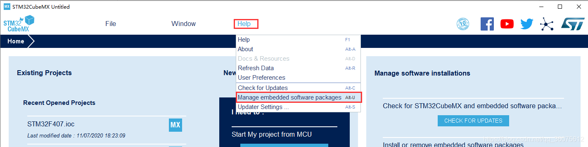

2. 添加NANO软件包,url链接 https://www.rt-thread.org/download/cube/RealThread.RT-Thread.pdsc(无需打开,只要复制到CubeMx中相应位置)

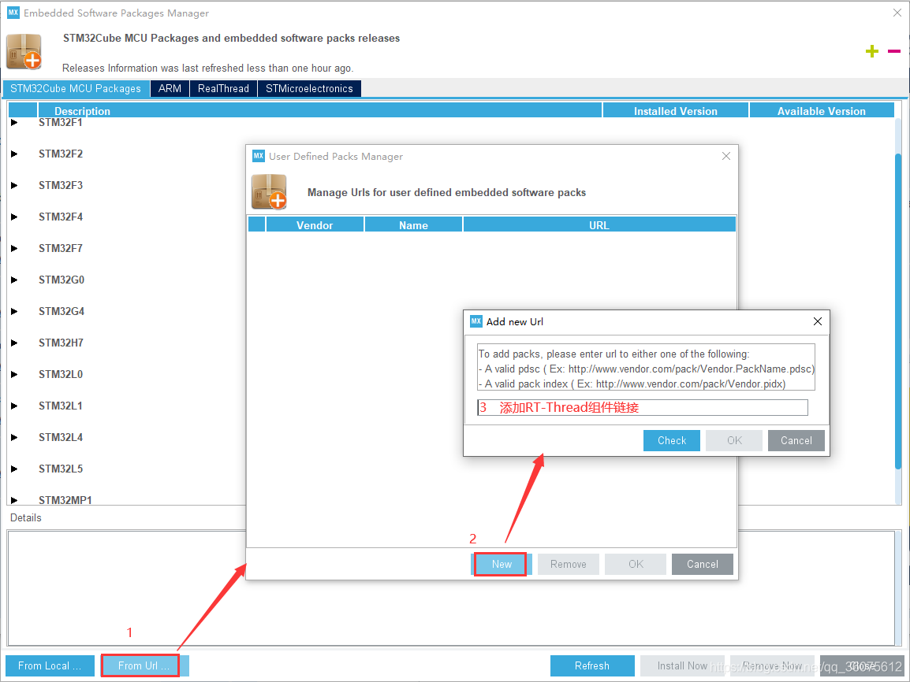

3. 输入NANO软件包链接

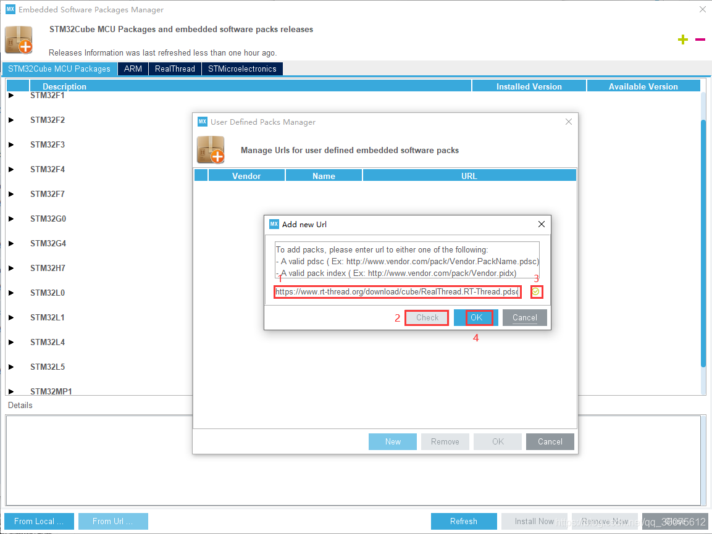

4. 下载,安装software packs

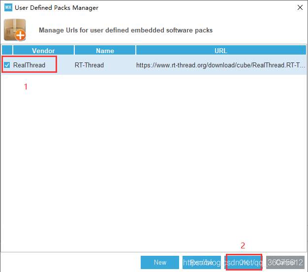

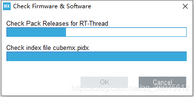

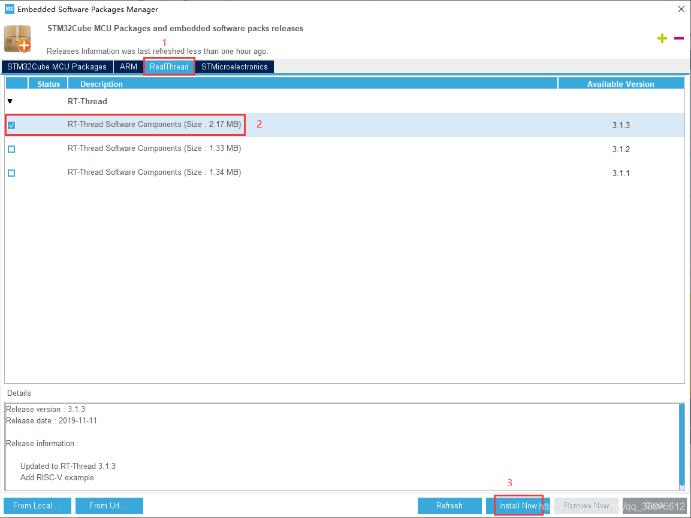

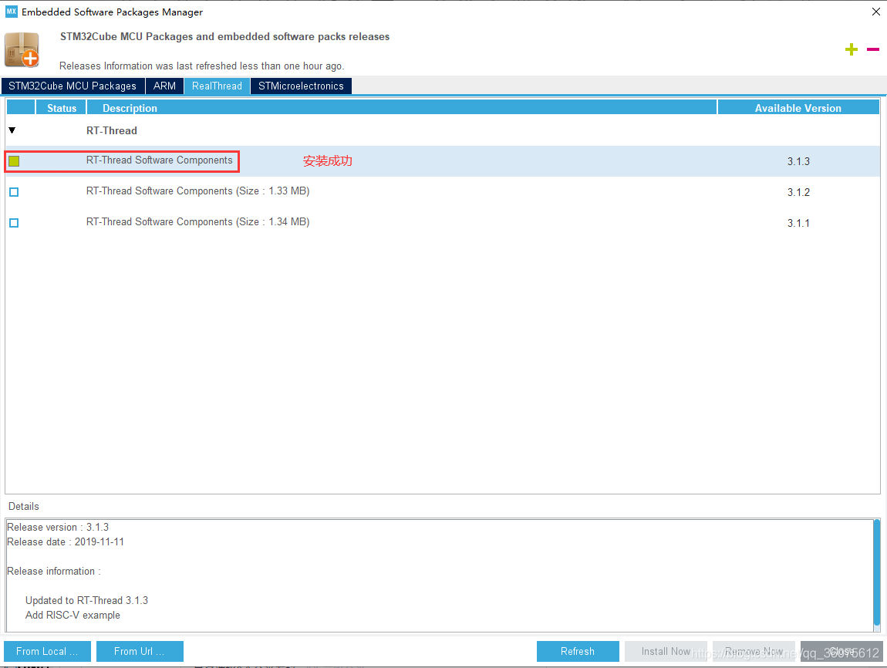

#### 创建工程

1. 第一步与之前类似,不再过多介绍

2. 添加组件包

   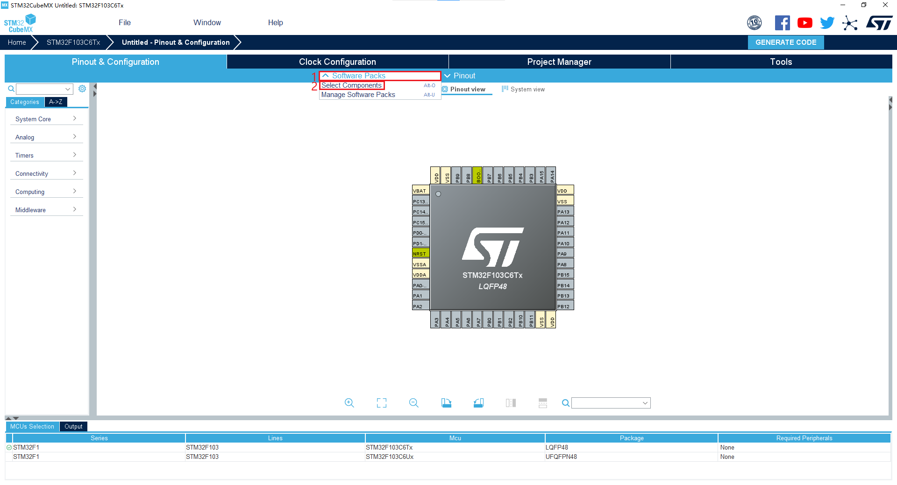

   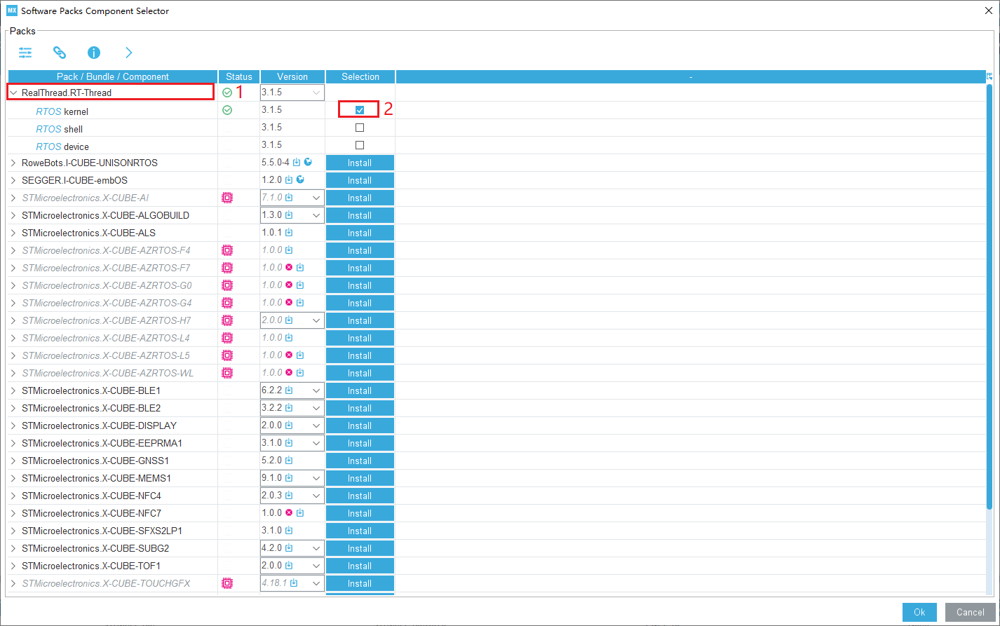

   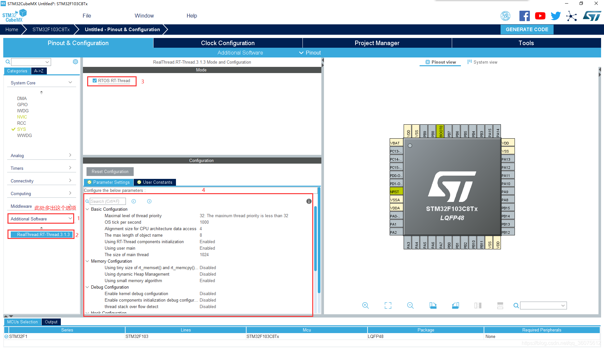

3. 更改TimeBase Source

   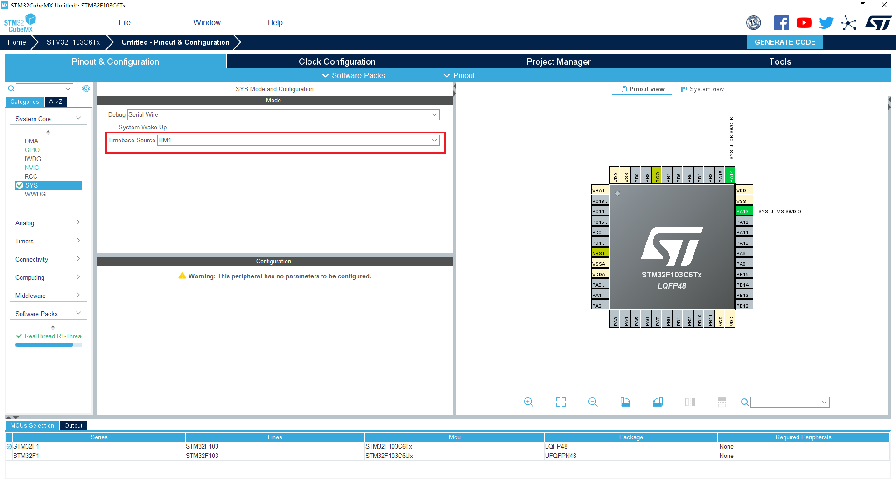

   此处可以改为除SysTick外的任意定时器作为HAL库的时基,因为SysTick已被RT-Thread占用,不能更改。

4. 找到***System Core*** ->***NIVC*** (取消**HardFault_Handler**、**PendSV_Handler**、**SysTick_Handler**中断函数(因为RTT已经定义了,需要取消))

   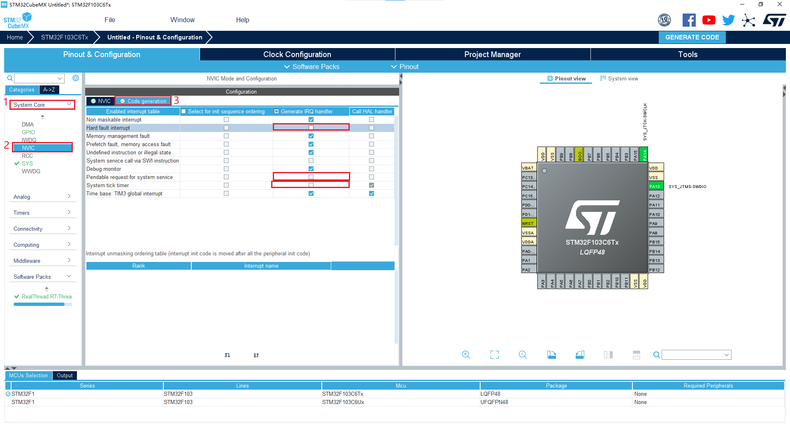

5. 配置USART2或取消调试台

   CubeMx添加RT-Thread会默认开启Console调试台以便于调试,每次重新生成代码都会将调试台配置为USART2 115200bps 8N1(更改方法见[^1]),若无需调试台可禁用(建议启用),禁用方法如下图,若不禁用,须配置USART2为 115200bps 8N1,否则系统会卡死。

   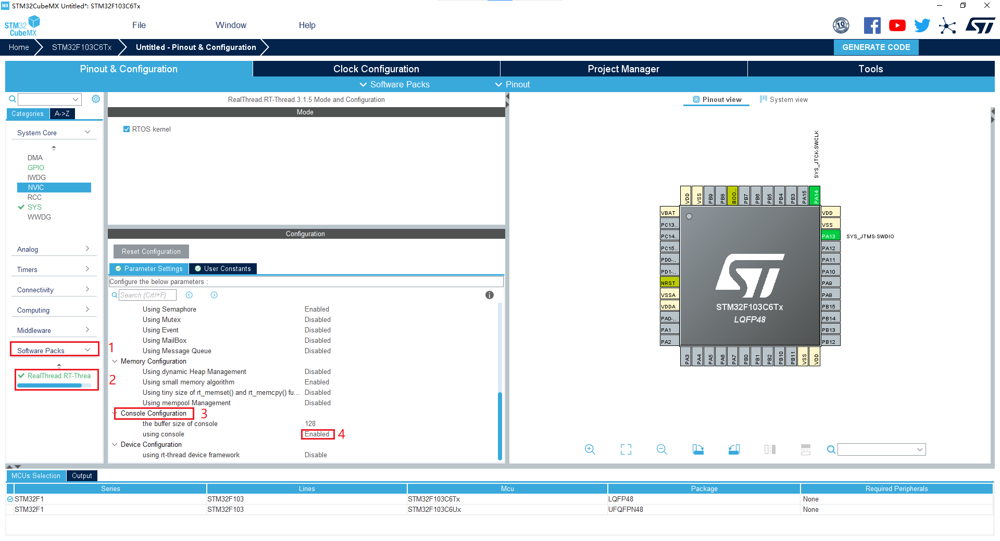

6. 生成工程前面也有说明,不在赘述

7. 若配置正确,编译下载后串口应输出如下字符

   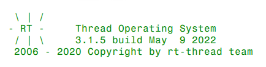

   [^1]: 打开\Middlewares\Third_Party\RealThread_RTOS\bsp\_template\cubemx_config中的board.c,搜索函数uart_init,更改函数中的参数即可,但每次重新生成代码都有更改一次。

### 单线程SRAM静态内存

#### 定义线程控制块

```c
/* 定义线程控制块 */
static struct rt_thread led1_thread;
```

#### 定义线程栈和入口函数

```c
static rt_uint8_t rt_led1_thread_stack[1024];
static void led1_thread_entry(void* parameter);
```

#### 初始化函数

需要在初始化时调用

##### 初始化线程

```c
//初始化LED线程
rt_thread_init(&led1_thread, /* 线程控制块 */
               "led1", /* 线程名字 */
               led1_thread_entry, /* 线程入口函数 */
               RT_NULL, /* 线程入口函数参数 */
               &rt_led1_thread_stack[0], /* 线程栈起始地址 */
               sizeof(rt_led1_thread_stack), /* 线程栈大小 */
               3, /* 线程的优先级 */
               20); /* 线程时间片 */
```

##### 启动线程调度

```c
rt_thread_startup(&led1_thread); /* 启动线程,开启调度 */
```

#### 线程函数

注意!!!线程函数不能返回,一定要是死循环。

```c
static void led1_thread_entry(void* parameter)
{
	while (1)
	{
		HAL_GPIO_WritePin(LED_GPIO_Port,LED_Pin,GPIO_PIN_SET);
		rt_thread_delay(500); /* 延时 500 个 tick */
		HAL_GPIO_WritePin(LED_GPIO_Port,LED_Pin,GPIO_PIN_RESET);
		rt_thread_delay(500); /* 延时 500 个 tick */
	}
}
```

#### 示例程序

```c

/* 定义线程控制块 */
static struct rt_thread led1_thread;
/* 定义线程控栈时要求 RT_ALIGN_SIZE 个字节对齐 */
ALIGN(RT_ALIGN_SIZE)
/* 定义线程栈 */
static rt_uint8_t rt_led1_thread_stack[1024];
static void led1_thread_entry(void* parameter);
 
//初始化线程函数
void MX_RT_Thread_Init(void)
{
	//初始化LED线程
	rt_thread_init(&led1_thread, /* 线程控制块 */
								 "led1", /* 线程名字 */
								 led1_thread_entry, /* 线程入口函数 */
								 RT_NULL, /* 线程入口函数参数 */
								 &rt_led1_thread_stack[0], /* 线程栈起始地址 */
								 sizeof(rt_led1_thread_stack), /* 线程栈大小 */
								 3, /* 线程的优先级 */
								 20); /* 线程时间片 */
	rt_thread_startup(&led1_thread); /* 启动线程,开启调度 */
}
 
/*
*************************************************************************
* 线程定义
*************************************************************************
*/
static void led1_thread_entry(void* parameter)
{
	while (1)
	{
		HAL_GPIO_WritePin(LED_GPIO_Port,LED_Pin,GPIO_PIN_SET);
		rt_thread_delay(500); /* 延时 500 个 tick */
		HAL_GPIO_WritePin(LED_GPIO_Port,LED_Pin,GPIO_PIN_RESET);
		rt_thread_delay(500); /* 延时 500 个 tick */
	}
}
```

### 单线程SRAM动态内存


### 多线程SRAM动态内存

=======
